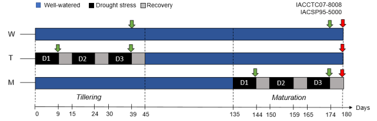
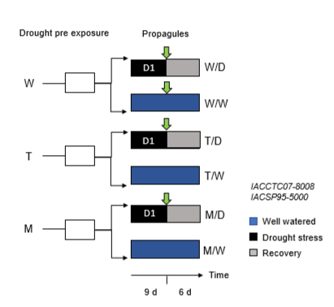

# Exposure of Sugarcane Plants to Drought Cycles at Different Phenological Stages

## Experimental Design

Three-month-old sugarcane seedlings of genotypes **IACSP95-5000** (productive material) and **IACCTC07-8008** (drought-tolerant material) developed by the Sugarcane Breeding Program of the Agronomic Institute (ProCana, IAC, Brazil) were transplanted into 20 L pots containing red-yellow latosol and fertilized. Cultivation was carried out in a greenhouse with daily irrigation.

## Treatment Groups

At five months of age (from transplant date), plants were divided into three experimental groups per genotype (total of six groups).

### a) W (Well-watered)
- **Treatment**: Maintained under daily irrigation
- **Purpose**: Control group

### b) T (Tillering)  
- **Treatment**: Subjected to three drought cycles during the tillering phase
- **Purpose**: Assess drought stress during vegetative growth

### c) M (Maturation)
- **Treatment**: Subjected to three drought cycles during the maturation phase  
- **Purpose**: Assess drought stress during reproductive development

## Drought Cycle Protocol

**Drought induction**: Irrigation suspension for **9 days**

**Recovery period**: Plants re-irrigated for **6 days** after each drought interval

**Total cycles**: 3 drought/recovery cycles per treatment group

This experimental design allows for the evaluation of genotype-specific responses to drought stress at two different developmental stages in sugarcane.

*Figure 1. Schematic showing drought cycles in two sugarcane genotypes (IACCTC08-8008 and IACSP95-5000) and in two phenological phases (tillering and maturation). W (control), plants maintained with irrigation throughout the experiment; T, plants subjected to three drought cycles (D1, D2, D3) during the tillering phase; M, plants subjected to three drought cycles (D1, D2, D3) during the maturation phase. Green arrows indicate leaf sample (NOT AVAIABLE) collection and red arrows indicate bud collection (AVAIABLE)*

# Propagule Experiment

At the end of the experiment, stem cuttings were collected and new seedlings were vegetatively propagated from the above experimental groups to carry out the propagule experiment where we evaluated the "heritability" of drought memory.

Three-month-old sugarcane seedlings of genotypes IACSP95-5000 and IACCTC07-8008 obtained through vegetative propagation from groups W, T and M were transplanted into 12 L pots containing red-yellow latosol and fertilized. Cultivation was carried out in a greenhouse with daily irrigation.

At two months of age (from transplant), plants were divided and drought treatment was initiated in both genotypes (total of 12 groups):

## Treatment Groups

### a) W/D
- **Origin**: Propagules obtained from non-stressed plants
- **Treatment**: Subjected to one drought cycle

### b) W/W  
- **Origin**: Propagules obtained from non-stressed plants
- **Treatment**: Well-watered

### c) T/D
- **Origin**: Propagules obtained from plants stressed during tillering
- **Treatment**: Subjected to one drought cycle

### d) T/W
- **Origin**: Propagules obtained from plants stressed during tillering  
- **Treatment**: Well-watered

### e) M/D
- **Origin**: Propagules obtained from plants stressed during maturation
- **Treatment**: Subjected to one drought cycle

### f) M/W
- **Origin**: Propagules obtained from plants stressed during maturation
- **Treatment**: Well-watered

## Drought Cycle Protocol

**Drought induction**: Irrigation suspension for **9 days**

**Recovery period**: Plants re-irrigated after the cycle completion (**6 days** recovery)

*Figure 2. Experimental scheme of sugarcane propagules from two genotypes (IACCTC08-8008 and IACSP95-5000) subjected to one drought cycle. Green arrows indicate leaf sample collection for transcriptomic analysis*

# So, what do we have?

According to the to description of the experimental desgin, in the first experiment we should have 6 groups and 18 samples (1 sample = 1 biological replicate, 3 samples compose one group).
For the second experiment we should have 12 groups and 36 samples. In total we have 18/18 samples for the first experiment and 33/36 samples for the second. (17/18 groups and 51/54 samples). This is strange
because the original metadata table ([experimental desing](Esquema_experimental_RNAseq.pdf)) suggest in total 26 groups and 78 samples.

Follows the table crossing the information frmom the fastq files and metadata provided information, where "Generation " Mt = Mother tillering, Mm = Mother maturing, Fw = Son watered, Fm = Son maturing, Ft = Son tillering, G1 = first experiment, W = watered, D, D1 and D3 = dry periods, the column "Exist" tells if there is a file for that sample. In Phenological_stage "A" denotes the second experiment.

| Sample | Genotype | Generation | Treatment | Repetition | Group | Tissue | Exist | Phenological_stage |
|--------|----------|------------|-----------|------------|-------|--------|-------|-------------------|
| Dolores_249_S3 | 5000 | Mt | W | 1 | 5000_Mt_W | Leaf | YES | A |
| 250_S2 | 5000 | Mt | W | 2 | 5000_Mt_W | Leaf | YES | A |
| 251_S3 | 5000 | Mt | W | 3 | 5000_Mt_W | Leaf | YES | A |
| Dolores_257_S5 | 8008 | Mt | W | 1 | 8008_Mt_W | Leaf | YES | A |
| 258_S5 | 8008 | Mt | W | 2 | 8008_Mt_W | Leaf | YES | A |
| Dolores_259_S6 | 8008 | Mt | W | 3 | 8008_Mt_W | Leaf | YES | A |
| 156_S22 | 5000 | Mm | W | 1 | 5000_Mm_W | Leaf | YES | A |
| 154_S28 | 5000 | Mm | W | 2 | 5000_Mm_W | Leaf | YES | A |
| 155_S11 | 5000 | Mm | W | 3 | 5000_Mm_W | Leaf | YES | A |
| 161_S13 | 8008 | Mm | W | 1 | 8008_Mm_W | Leaf | YES | A |
| 162_S20 | 8008 | Mm | W | 2 | 8008_Mm_W | Leaf | YES | A |
| 163_S7 | 8008 | Mm | W | 3 | 8008_Mm_W | Leaf | YES | A |
| 157_S12 | 5000 | Mt | D1 | 1 | 5000_Mt_D1 | Leaf | YES | A |
| D158_S48 | 5000 | Mt | D1 | 2 | 5000_Mt_D1 | Leaf | NO | A |
| 159_S5 | 5000 | Mt | D1 | 3 | 5000_Mt_D1 | Leaf | NO | A |
| 165_a_S40 | 8008 | Mt | D1 | 1 | 8008_Mt_D1 | Leaf | YES | A |
| 166_S23 | 8008 | Mt | D1 | 2 | 8008_Mt_D1 | Leaf | YES | A |
| 168_S25 | 8008 | Mt | D1 | 3 | 8008_Mt_D1 | Leaf | YES | A |
| 253_S41 | 5000 | Mm | D1 | 1 | 5000_Mm_D1 | Leaf | YES | A |
| 254_S7 | 5000 | Mm | D1 | 2 | 5000_Mm_D1 | Leaf | NO | A |
| 255_S8 | 5000 | Mm | D1 | 3 | 5000_Mm_D1 | Leaf | NO | A |
| 261_S9 | 8008 | Mm | D1 | 1 | 8008_Mm_D1 | Leaf | NO | A |
| 262_S10 | 8008 | Mm | D1 | 2 | 8008_Mm_D1 | Leaf | NO | A |
| 263_S11 | 8008 | Mm | D1 | 3 | 8008_Mm_D1 | Leaf | NO | A |
| 221_S19 | 5000 | Mt | D3 | 1 | 5000_Mt_D3 | Leaf | YES | A |
| 222_S6 | 5000 | Mt | D3 | 2 | 5000_Mt_D3 | Leaf | NO | A |
| 223_S42 | 5000 | Mt | D3 | 3 | 5000_Mt_D3 | Leaf | YES | A |
| 230_S15 | 8008 | Mt | D3 | 1 | 8008_Mt_D3 | Leaf | YES | A |
| D231_D46 | 8008 | Mt | D3 | 2 | 8008_Mt_D3 | Leaf | NO | A |
| 232_S8 | 8008 | Mt | D3 | 3 | 8008_Mt_D3 | Leaf | YES | A |
| 9_S15 | 5000 | Mm | D3 | 1 | 5000_Mm_D3 | Leaf | NO | A |
| 10_S16 | 5000 | Mm | D3 | 2 | 5000_Mm_D3 | Leaf | NO | A |
| 11_S1 | 5000 | Mm | D3 | 3 | 5000_Mm_D3 | Leaf | YES | A |
| 13_S17 | 8008 | Mm | D3 | 1 | 8008_Mm_D3 | Leaf | NO | A |
| X_14 | 8008 | Mm | D3 | 2 | 8008_Mm_D3 | Leaf | NO | A |
| 15_S18 | 8008 | Mm | D3 | 3 | 8008_Mm_D3 | Leaf | NO | A |
| 33_S2 | 5000 | Fw | W | 1 | 5000_Fw_W | Leaf | YES | A |
| 34_S19 | 5000 | Fw | W | 2 | 5000_Fw_W | Leaf | NO | A |
| 35_S9 | 5000 | Fw | W | 3 | 5000_Fw_W | Leaf | YES | A |
| D33_S40 | 5000 | Fw | D1 | 1 | 5000_Fw_D1 | Leaf | NO | A |
| 42_S39 | 5000 | Fw | D1 | 2 | 5000_Fw_D1 | Leaf | YES | A |
| D43_S52 | 5000 | Fw | D1 | 3 | 5000_Fw_D1 | Leaf | NO | A |
| 53_S10 | 5000 | Ft | D1 | 1 | 5000_Ft_D1 | Leaf | YES | A |
| D54_S53 | 5000 | Ft | D1 | 2 | 5000_Ft_D1 | Leaf | NO | A |
| X_55 | 5000 | Ft | D1 | 3 | 5000_Ft_D1 | Leaf | NO | A |
| 65_S3 | 5000 | Fm | D1 | 1 | 5000_Fm_D1 | Leaf | YES | A |
| 66_S4 | 5000 | Fm | D1 | 2 | 5000_Fm_D1 | Leaf | YES | A |
| 67_S5 | 5000 | Fm | D1 | 3 | 5000_Fm_D1 | Leaf | YES | A |
| D69_S47 | 8008 | Fw | W | 1 | 8008_Fw_W | Leaf | NO | A |
| 70_S34 | 8008 | Fw | W | 2 | 8008_Fw_W | Leaf | YES | A |
| D71_S54 | 8008 | Fw | W | 3 | 8008_Fw_W | Leaf | NO | A |
| X_77 | 8008 | Fw | D1 | 1 | 8008_Fw_D1 | Leaf | NO | A |
| 79_S2 | 8008 | Fw | D1 | 2 | 8008_Fw_D1 | Leaf | NO | A |
| 79_S6 | 8008 | Fw | D1 | 3 | 8008_Fw_D1 | Leaf | YES | A |
| 89_S30 | 8008 | Ft | D1 | 1 | 8008_Ft_D1 | Leaf | YES | A |
| D66_S41 | 8008 | Ft | D1 | 2 | 8008_Ft_D1 | Leaf | NO | A |
| 91_S37 | 8008 | Ft | D1 | 3 | 8008_Ft_D1 | Leaf | YES | A |
| 101_S20 | 8008 | Fm | D1 | 1 | 8008_Fm_D1 | Leaf | NO | A |
| 102_S3 | 8008 | Fm | D1 | 2 | 8008_Fm_D1 | Leaf | NO | A |
| 103_S4 | 8008 | Fm | D1 | 3 | 8008_Fm_D1 | Leaf | NO | A |
| 21DH5_S21 | 5000 | G1 | D | 1 | 5000_Maturation_D | Bud | YES | Maturation |
| 21DH8_S24 | 8008 | G1 | D | 1 | 8008_Maturation_D | Bud | YES | Maturation |
| 22DH5_S22 | 5000 | G1 | D | 2 | 5000_Maturation_D | Bud | YES | Maturation |
| 22DH8_S25 | 8008 | G1 | D | 2 | 8008_Maturation_D | Bud | YES | Maturation |
| 23DH5_S23 | 5000 | G1 | D | 3 | 5000_Maturation_D | Bud | YES | Maturation |
| 23DH8_S26 | 8008 | G1 | D | 3 | 8008_Maturation_D | Bud | YES | Maturation |
| FIDH15000_S27 | 5000 | G1 | D | 1 | 5000_Tillering_D | Bud | YES | Tillering |
| FIDH1800_S30 | 8008 | G1 | D | 1 | 8008_Tillering_D | Bud | YES | Tillering |
| FIDH25000_S28 | 5000 | G1 | D | 2 | 5000_Tillering_D | Bud | YES | Tillering |
| FIDH28000_S31 | 8008 | G1 | D | 2 | 8008_Tillering_D | Bud | YES | Tillering |
| FIDH35000_S29 | 5000 | G1 | D | 3 | 5000_Tillering_D | Bud | YES | Tillering |
| FIDH38000_S32 | 8008 | G1 | D | 3 | 8008_Tillering_D | Bud | YES | Tillering |
| F25C1_S6 | 5000 | G1 | W | 1 | 5000_Maturation_W | Bud | YES | Maturation |
| F25C2_S7 | 5000 | G1 | W | 2 | 5000_Maturation_W | Bud | YES | Maturation |
| F25C3_S8 | 5000 | G1 | W | 3 | 5000_Maturation_W | Bud | YES | Maturation |
| F28C1_S9 | 8008 | G1 | W | 1 | 8008_Maturation_W | Bud | YES | Maturation |
| F28C2_S10 | 8008 | G1 | W | 2 | 8008_Maturation_W | Bud | YES | Maturation |
| F28C3_S11 | 8008 | G1 | W | 3 | 8008_Maturation_W | Bud | YES | Maturation |

# Results

We can divide our analysis in three steps: data cleaning, preliminary analysis and analysis.

## Data cleaning

We assessed the quality of the raw sequencing data using **FastQC**, and summarized the results across all samples with **MultiQC**.  

Reads were then cleaned with **BBDuk**, using the SILVA and Rfam databases to remove rRNA contamination. The following parameters were applied:  

- `forcetrimleft=11` → removes the first 11 bases from the 5′ end.  
- `forcetrimright2=3` → removes 3 bases from the 3′ end.  
- `minlength=80` → discards reads shorter than 80 bp after trimming.  
- `qtrim=w` → trims both ends of the read based on quality.  
- `trimq=20` → sets the quality threshold for trimming (Phred score 20).  
- `tpe=t` → trims both reads in a pair equally.  
- `tbo=t` → trims adapters based on pair overlap.  

